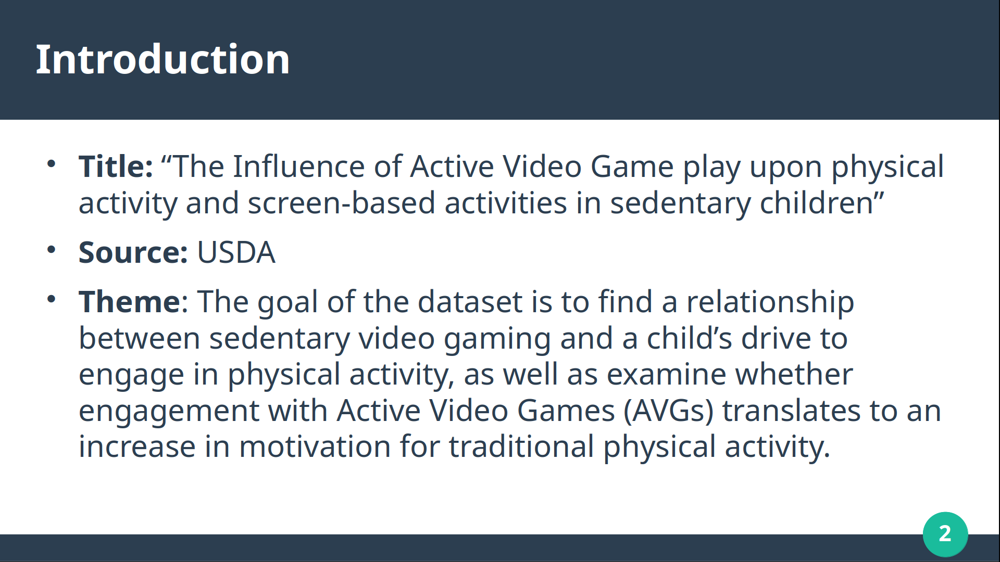
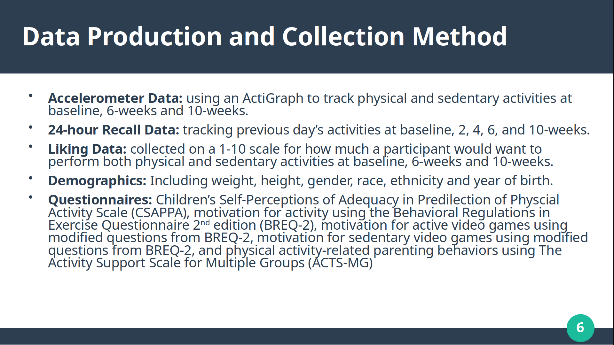
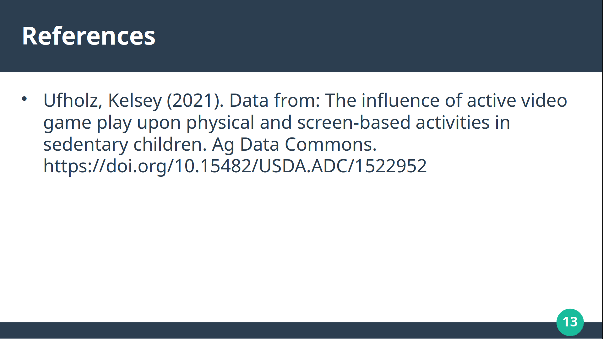

# What Gets Counted Counts - Data Analysis Project

A comprehensive data analysis project investigating trends, biases, and opportunities for improvement in dataset collection and usability. This project was completed as part of coursework at The University of Tennessee Knoxville.

## Project Overview

This project examines a dataset through a critical lens to understand what information is being collected, how it reflects societal priorities, and where biases and gaps exist. By analyzing the data's purpose, collection methods, and underlying power structures, we identify concrete opportunities to improve data quality and usability for future collections.

### Key Questions Addressed
- What does this dataset reveal about what society values?
- What biases exist in how the data was collected and categorized?
- How can we enhance the dataset to be more representative and useful?

---

## Dataset Purpose

- The dataset was published by the Agricultural Research Service and was intended to find effective ways to encourage children to be more active.
- The study included children born between 2004 and 2008, the activity statistics, questionnaire answers, 24-hour recall data and accelerometer data.
- Likely intended audience is parents, teachers, and anyone in a position to influence children's engagement in physical activity.

---

## Project Motivation

- The dataset captured my curiosity due to a variety of reasons. Primarily my interest in video games and the potential implications of the hobby.

---

## Data Collection Methodology

---

## Data Analysis

Our analysis revealed important trends in the data:
- AVGs provided only a temporary boost in physical activity.
- Enjoyment of AVGs did not influence the psychology of already sedentary children.
- Enjoyment of AVGs did not translate to enjoyment for traditional physical activity.
- Children tended to overcompensate for energy spend on PA or AVGs with increased sedentary behavior.
- Missing data includes device calibrations, specific questionnaire questions, AVG titles and environmental contexts such as access to green spaces or neighborhood safety scores.

### Sedentary Behavior Increase

### Physical Activity Decrease

---

## Additional Elements for Improvement

- Increasing the sample size would allow for a much more widely applicable dataset.
- Wider age range to include children with potentially different relationships with technology.
- Tracking sleep time could explain daily changes in physical or sedentary behavior.
- Including programs or steps to log real time activity data would eliminate the reliance on children's recall memory.

These elements are critical for understanding the complete picture and avoiding oversimplified conclusions.

---

## Power Dynamics & Bias

### Why This Matters
The categories we count shape policy decisions, resource allocation, and societal priorities. When biases exist in what gets counted, they perpetuate inequities in how resources and attention are distributed.

---

## Study Limitations

It's important to acknowledge the constraints of this analysis:

- The study only took place within a short time frame, from 2016-2018 and only children born between 2004 and 2008 participated in the study.
- The dataset only included a small sample size of 49 participants, and was incomplete in many areas due to participants leaving before the end of the study.
- Intervention only took place over the course of 10-weeks.
- Included only children already labeled as sedentary, and did not include children who do not play sedentary video game.
- Lacked a real control group.
- Some of the data relies on child recall memory which can be limited or include inherent bias due to the nature of the intervention.

These limitations don't invalidate our findings but provide important context for interpreting results and guiding future research.

---

## Conclusions

- Through our analysis of the dataset, we are able to conclude that providing children with Active Video Games did not translate to an increase in traditional physical activities. Rather, the introduction seemed to cause a general decrease in physical activity and and increase in sedentary activity.

### Major Takeaways

1. **Data is Not Neutral**: What gets counted reflects choices about what matters, made by people with specific perspectives and power
2. **Trends Have Context**: The trends we observed cannot be understood apart from the biases and limitations in how the data was collected
3. **Improvement is Possible**: Through intentional redesign and stakeholder inclusion, we can create datasets that are more equitable, accurate, and useful
4. **Ongoing Vigilance Needed**: Even improved systems require continuous monitoring and adjustment to prevent new biases from emerging

### Implications for Future Research
This project demonstrates the importance of critical data analysis that looks beyond the numbers to examine:
- Who decided what to measure
- What was excluded from measurement
- How measurement choices reflect and reinforce power structures

By asking these questions systematically, we can work toward data systems that better serve all stakeholders and contribute to more just and evidence-informed decision-making.

---

## References

---

**Project Completed**: University of Tennessee Knoxville  
**Author**: Evan Moore 

For questions or to discuss findings, please feel free to open an issue in this repository.
