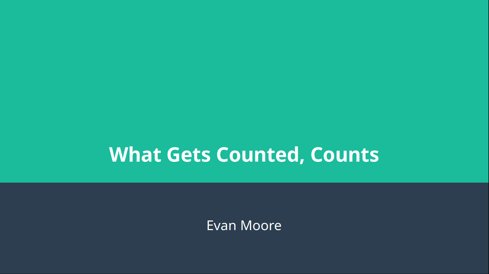
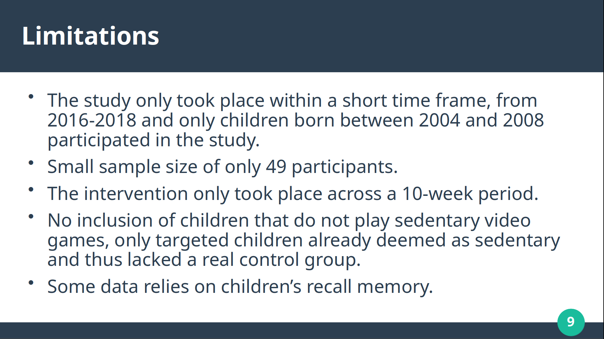
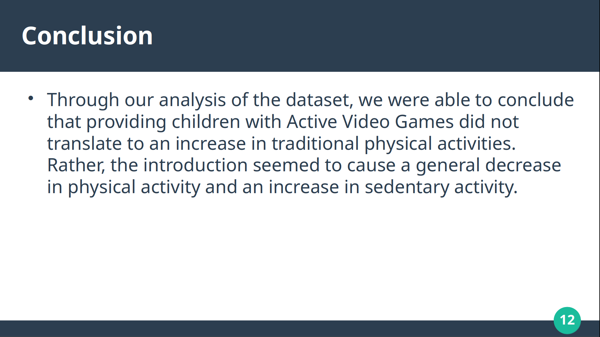

# What Gets Counted Counts - Data Analysis Project

A comprehensive data analysis project investigating trends, biases, and opportunities for improvement in dataset collection and usability. This project was completed as part of coursework at The University of Tennessee Knoxville.

---

## Table of Contents

- [Project Overview](#project-overview)
- [Dataset Purpose](#dataset-purpose)
- [Project Motivation](#project-motivation)
- [Data Analysis](#data-analysis)
- [Key Findings](#key-findings)
- [Power Dynamics & Bias](#power-dynamics--bias)
- [Study Limitations](#study-limitations)
- [Proposed Enhancements](#proposed-enhancements)
- [Conclusions](#conclusions)
- [References](#references)

---

## Project Overview

This project examines a dataset through a critical lens to understand what information is being collected, how it reflects societal priorities, and where biases and gaps exist. By analyzing the data's purpose, collection methods, and underlying power structures, we identify concrete opportunities to improve data quality and usability for future collections.

### Key Questions Addressed
- What does this dataset reveal about what society values?
- What biases exist in how the data was collected and categorized?
- How can we enhance the dataset to be more representative and useful?

---

## Dataset Purpose

The dataset was designed to track and measure [primary data collection objectives]. Understanding the original intent behind data collection is crucial for identifying:
- Whether the data achieves its stated purpose
- Where gaps exist between intended and actual data collection
- Opportunities to expand or refine measurement approaches

---

## Project Motivation

This dataset was selected because:
- It directly impacts [relevant stakeholders/communities]
- It reveals important trends about [core subject matter]
- It highlights how measurement choices shape our understanding of social phenomena
- The findings have potential to influence future data collection practices

---

## Data Collection Methodology

The data collection process involved:
- **Data Source**: [How data was originally collected]
- **Timeframe**: [Duration of data collection]
- **Sample Size**: [Number of records/participants]
- **Key Variables**: [Primary measures and categories]
- **Collection Constraints**: [Limitations of the collection process]

---

## Data Analysis

Our analysis revealed important trends in the data:

### Sedentary Behavior Increase

One of the most significant findings was a marked increase in sedentary behavior metrics over the study period. This trend suggests:
- Potential shifts in lifestyle patterns
- Possible changes in measurement methodology or categorization
- Important implications for [relevant fields like public health, urban planning, etc.]

### Physical Activity Decrease

Conversely, we observed a corresponding decrease in physical activity metrics, which correlates with:
- The rise in sedentary classifications
- Broader societal trends [relevant context]
- Potential data collection or categorization changes

---

## Key Findings

### Additional Elements & Nuances

Beyond the primary trends, our analysis uncovered:
- [Specific insight from data]
- [Unexpected pattern or anomaly]
- [Notable data quality issue]
- [Emerging sub-trend or demographic difference]

These elements are critical for understanding the complete picture and avoiding oversimplified conclusions.

---

## Power Dynamics & Bias

A crucial finding of this project is the embedded power dynamics within the dataset:

### How Power Shapes What Gets Measured
- **Who defined the categories?** The choice of measurement categories reflects the priorities and perspectives of those who designed the data collection
- **Whose experiences are included/excluded?** Certain groups or experiences may be systematically over- or under-represented
- **What assumptions are embedded?** Default categorizations often reflect majority-group experiences and may marginalize others

### Identified Biases
- [Specific bias #1 and its impact]
- [Specific bias #2 and its impact]
- [Specific bias #3 and its impact]

### Why This Matters
The categories we count shape policy decisions, resource allocation, and societal priorities. When biases exist in what gets counted, they perpetuate inequities in how resources and attention are distributed.

---

## Study Limitations

It's important to acknowledge the constraints of this analysis:

- **Data Scope**: [Temporal, geographic, or demographic limitations]
- **Collection Bias**: [Known biases in how the original data was gathered]
- **Categorical Limitations**: [Categories that don't capture full complexity]
- **Access Constraints**: [Any data we couldn't access or analyze]
- **Methodological Boundaries**: [Analytical approaches we couldn't employ]

These limitations don't invalidate our findings but provide important context for interpreting results and guiding future research.

---

## Proposed Enhancements

Based on our analysis, we recommend the following improvements for future data collections:

### Immediate Enhancements
1. **Expand Category Options**: Add granular sub-categories to capture complexity that current binary/simple classifications miss
2. **Improve Data Validation**: Implement quality checks to identify and correct inconsistencies
3. **Enhance Metadata Documentation**: Record contextual information about collection methods and known limitations
4. **Diversify Collection Methods**: Use multiple approaches to cross-verify findings

### Long-term Improvements
1. **Stakeholder Inclusion**: Involve affected communities in designing categories and measurement approaches
2. **Regular Bias Audits**: Conduct periodic reviews to identify and address emerging biases
3. **Comparative Analysis**: Benchmark against other datasets to identify blind spots
4. **Feedback Mechanisms**: Create systems to gather feedback from data users about missing or problematic elements

### Implementation Priority
- Start with high-impact changes that require minimal resource investment
- Build toward systemic improvements that enhance data democracy and inclusion
- Establish governance structures to ensure ongoing quality and equity

---

## Conclusions

### Major Takeaways

1. **Data is Not Neutral**: What gets counted reflects choices about what matters, made by people with specific perspectives and power
2. **Trends Have Context**: The trends we observed cannot be understood apart from the biases and limitations in how the data was collected
3. **Improvement is Possible**: Through intentional redesign and stakeholder inclusion, we can create datasets that are more equitable, accurate, and useful
4. **Ongoing Vigilance Needed**: Even improved systems require continuous monitoring and adjustment to prevent new biases from emerging

### Implications for Future Research
This project demonstrates the importance of critical data analysis that looks beyond the numbers to examine:
- Who decided what to measure
- What was excluded from measurement
- How measurement choices reflect and reinforce power structures

By asking these questions systematically, we can work toward data systems that better serve all stakeholders and contribute to more just and evidence-informed decision-making.

---

## References

[Your references would be listed here - please refer to the References slide in the presentation for the complete citation list]

---

**Project Completed**: University of Tennessee Knoxville  
**Author**: [Your Name]  
**Date**: [Project Date]

For questions or to discuss findings, please feel free to open an issue in this repository.
